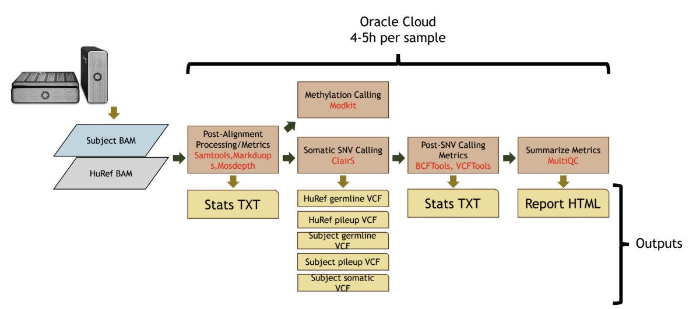

# sarek_pipeline

> **Full open-source Nextflow pipeline for the analysis of STATE sequencing data.**

## Introduction

This repository provides a pipeline that builds upon the **[nf-core/sarek](https://github.com/nf-core/sarek)** workflow. The original implementation utilizes the workflow tool, [Nextflow](https://www.nextflow.io), to detect and identify variants in both germline and somatic samples. Sarek can handle any genome with a known reference. This repo was custom-developed to include the [ClairS](https://github.com/HKU-BAL/ClairS) and [Modkit](https://github.com/nanoporetech/modkit) modules in order to optimize the computational analysis of long read sequencing platforms. The introduced Nextflow-based somatic calling and methylation calling pipeline schema takes in BAM files and outputs unfiltered and filtered VCFs with additional quality control reports.

## Pipeline summary

By default, the pipeline currently performs the following:

- Sequencing quality control (`FastQC`)
- Map Reads to Reference (`BWA mem`)
- Mark Duplicates (`GATK MarkDuplicates`)
- Preprocessing quality control (`samtools stats`)
- Preprocessing quality control (`mosdepth`)
- Overall pipeline run summaries (`MultiQC`)

<p align="center">
    
</p>

## Quick Start

1. Install [`Nextflow`](https://www.nextflow.io/docs/latest/getstarted.html#installation) (version should be `>=21.10.3, <=22.10.4`)

2. Install any of [`Docker`](https://docs.docker.com/engine/installation/), [`Singularity`](https://www.sylabs.io/guides/3.0/user-guide/) (you can follow [this tutorial](https://singularity-tutorial.github.io/01-installation/)), [`Podman`](https://podman.io/), [`Shifter`](https://nersc.gitlab.io/development/shifter/how-to-use/) or [`Charliecloud`](https://hpc.github.io/charliecloud/) for full pipeline reproducibility _(you can use [`Conda`](https://conda.io/miniconda.html) both to install Nextflow itself and also to manage software within pipelines. Please only use it within pipelines as a last resort; see [docs](https://nf-co.re/usage/configuration#basic-configuration-profiles))_.

3. Clone this repository and cd into it.
   ```bash
   git clone https://github.com/eitm-org/sarek_pipeline.git
   cd ./sarek_pipeline
   ```
4. In order to start running your analysis, you have to generate a CSV file that provides location and sample-specific information for the input BAM files. See [sample sheet configurations]([https://nf-co.re/sarek/usage](https://nf-co.re/sarek/usage#input-sample-sheet-configurations) for more information about the required samplesheet columns and different configurations.

5. Run the pipeline!

   ```bash
   nextflow run eitm-org/sarek-pipeline 
     -profile docker -r master --input samplesheet.csv --outdir <Output directory> \
     --skip_tools baserecalibrator --igenomes_ignore --step markduplicates \
     --fasta <Path to FASTA genome file> \
     --fasta_fai <Path to FASTA reference index> \
     --dict <Path to FASTA dictionary file> \
     --intervals <Path to target bed file> \
     --vcf_header <VCF header file>
     --save_mapped -resume > <LOGFILE>
  
   ```
See [VCF specs](https://samtools.github.io/hts-specs/VCFv4.1.pdf) for more info about creating the VCF header file.

## Documentation

The nf-core/sarek pipeline comes with documentation about the pipeline [parameters](https://nf-co.re/sarek/parameters) and [output](https://nf-co.re/sarek/output). See [usage docs](https://nf-co.re/sarek/usage) for all of the available options when running the pipeline.

## Credits

**Development Lead:** Xingyao Chen <xchen@emila.org>
**Contributers:** 
* Abby Coleman <acoleman@emila.org>
* Mukta Ubale <mubale@emila.org>
* Vaidhyanathan Mahaganapathy <vmahaganapathy@emila.org> 

Sarek was originally written by Maxime Garcia and Szilveszter Juhos at the [National Genomics Infastructure](https://ngisweden.scilifelab.se) and [National Bioinformatics Infastructure Sweden](https://nbis.se) which are both platforms at [SciLifeLab](https://scilifelab.se), with the support of [The Swedish Childhood Tumor Biobank (Barntumörbanken)](https://ki.se/forskning/barntumorbanken).
Friederike Hanssen and Gisela Gabernet at [QBiC](https://www.qbic.uni-tuebingen.de/) later joined and helped with further development.              

## Citations

An extensive list of references for the tools used by the pipeline can be found in the [`CITATIONS.md`](CITATIONS.md) file.
